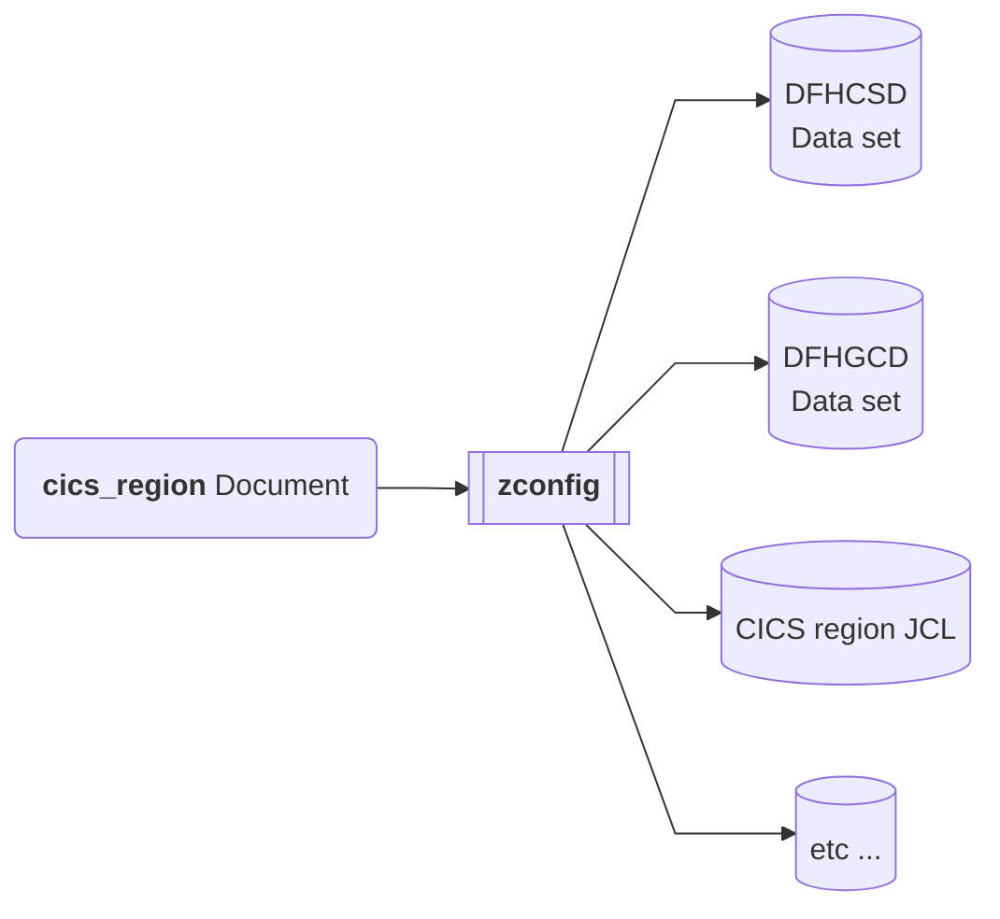

# Z Declarative Specification Framework Architecture

### Names

This document outlines the architecture of a framework for defining a family of declarative configuration languages, based around YAML.  These languages can all be translated, by the same tool, into in-situ z/OS configuration artifacts, as the system knows them today.  The language framework and configuration processing tool don't currently have names.  For the purposes of this document, I'm going to refer to the configuration language as `zyaml` and the tool that processes the configuration documents as `zconfig`.  The `cics_region` specification is an implementation of a declarative configuration language (for CICS), built on the (CICS-agnostic) framework that `zconfig` provides.  So it makes more sense to think of it as a `zconfig` tool, rather than CICS-specific.

### Workflow

`zyaml` is an extensible system for defining a family of custom declarative specification languages for z/OS configuration.  `zconfig` is a tool which provides a framework for defining custom processors which handle these configuration languages.  The idea is that `zyaml` can be used to standardize configuration, and realise configuration simplification, without changes to the underlying operating system, subsystems and middleware.  The `zconfig` tool achieves this by translating `zyaml` config documents into the pre-existing configuration that the underlying systems already use.


The `zconfig` tool provides a way of registering a custom handler for a particular flavour of `zyaml`.  Each implementation of a `zyaml` based configuration document can share configuration semantics, and benefit from features of the configuration tool.  Not many of these have been realised so far, but the ability to support variables, validation and syntax highlighting, and extensibility are good examples.

Provided in the repository is an example of a `zyaml` dialect for configuring a CICS region.  An example of the workflow when working with a CICS region configuration looks something like this:


### `zyaml` files

A `zyaml` configuration file is a YAML document.  Each document should have a single key defined at the document root.  This key is used to determine the configuration dialect.  The following document is an example of the `cics_region` configuration dialect:

```yaml
cics_region:
  applid: IYK2ZOE1
  cics_hlq: CTS610.CICS740
  region_hlq: STEWF.SHARE.IYK2ZOE1
  cics_data_sets:
    sdfhlic: CTS610.CICS740.LIC.SDFHLIC

  job_parameters:
    region: 0M

  sit_parameters:
    sit: 6$
    start: INITIAL
    cicssvc: 217
    grplist: (DFHLIST)
    srbsvc: 218
    usshome: /cics/cics740
    sysidnt: ZOE1
```

Beyond that requirement, the configuration language currently imposes no other constraints on the content of the file.  I could see this structure changing, to accommodate e.g. specifications for input parameters for the configuration.

There is some limited support for using variables in config files, but it's pretty rudimentary, and needs a bit more thinking for how to implement it, and whether we'd want to support embedded Jinja expressions, in the way that Ansible does.
### `zconfig` tool

The `zconfig` tool is an application that runs in Unix System Services, directly on z/OS.  In the interest of clarity, it's important to state at this point that this tool does not pre-req Ansible at all.  It does however pre-req the same technology base that the IBM z/OS Ansible collections do. The tool is a Python application, and many of the useful parts of the implementation rely on ZOAU to make changes to resources on z/OS.  There are a few other Python libraries used by the tool too.

At the current time, the configuration tool is executed against a directory.  This was intended to allow a directory of configuration files to represent the state of the system.  Tool execution looks like this:

```
zconfig -d .
```

I think we need to revise this, to execute against specific files, rather than implicitly running against all eligible files in the target directory, but that's the way it is at the moment.

When `zconfig` is executed, the YAML document is deserialised, the appropriate Python handler for the config type is loaded, and control is passed to it.   That python handler is responsible for making all of the state changes to the in-situ configuration on z/OS, though there is a library of utilities, and a framework for helping implement declarative behaviour.

### Declarative configuration

`zyaml` config files are intended to be declarative documents that represent the state of the target output files.  This means they should be useful both when applying a new configuration to z/OS, but also when updating an existing configuration with some changes.

This behaviour is intended to address one of the significant shortcomings of using Ansible as a configuration language for z/OS.  Whilst Ansible is a declarative configuration system, and Ansible playbooks are intended to be idempotent, in reality, idempotent playbooks are difficult to implement for z/OS, because we don't have the correct low-level primitives to be able to apply configuration idempotently.

The gist of this is, a `zyaml` config file should be able to either apply a new configuration from scratch, or reconcile itself against whatever configuration currently exists on the system.  The limitation being, the configuration had to be something that was originally derived from a `zyaml` document.  We'll be able to achieve this because we'll have standardized the configuration layout on z/OS, which is something we'll need to rely on.

This gives us the important quality that I can continuously configure a system using `zyaml`.  My original configuration is simple, because I just describe the state I want the system to be in.  When I want to change the configuration, I just update the document to describe the new state and reconcile it against the target system.  The `zconfig` tool implements the reconciliation itself.

### Registering a `ConfigType`

The `zconfig` tool supports processing of multiple types of configuration, using a registry system to find an appropriate handler for the configuration type.  When the tool starts, all subclasses of the type `zconfig.utils.config_type.ConfigType` are found, and added to a registry keyed by the value of their `REGISTRY_ID` field.  The system for registering these config types is implemented in [`processor.py`](../../zconfig/src/zconfig/cli/processor.py) and is pretty simplistic at the moment but meets our current needs.  You can see an example of a config type being defined in [`region.py`](../../zconfig/src/zconfig/tasks/cics/region.py).

### ConfigType implementation

Config types are responsible themselves for defining the process of how the configuration YAML is translated into in-situ configuration on z/OS.  However, config types shouldn't arbitrarily make changes to z/OS.  Instead, config types should register `Task`s which make the changes to the z/OS file system.  Tasks extend the superclass `zconfig.utils.task.Task`.  Within the execution of a task, they're able to do anything they want to affect the file system on z/OS.

Currently, `Task` instances must be set as member properties on a `ConfigType`.  The framework will inspect all of the properties of the config type, and register `Task` properties for execution.  A graph is built to determine task execution order, and tasks are executed in parallel where possible, from this graph.

### Extensions

Extensions are a special type of config type that extend the base `zconfig.utils.extension.Extension` class (which itself extends `Task`). Extensions provide pre-canned configuration that can be applied over a base config type. For example, the `cics_cmci` extension packages up configuration including resource definitions, SIT parameters, and startup JCL DDs, and plugs that into the `cics_region` config type, while also performing validation on those input combinations. This allows common configuration patterns to be reused across multiple regions without duplicating YAML. You can see examples of extensions in [`application.py`](../../zconfig/src/zconfig/tasks/cics/application.py) and [`cics_cmci.py`](../../zconfig/src/zconfig/tasks/cics/cics_cmci.py).

### Tasks

The purpose of tasks is:
- To update the contents of output files, when the inputs change
- To control parallel processing when applying a configuration to z/OS

Each output file is associated with a specific individual task.  The task is essentially a function, which transforms its inputs into the output file.  An important consideration here is that output of one task can be the input to another.  This gives us an important primitive for implementing reconciliation, and a means to determine the execution order, including which tasks can be executed in parallel.
#### Task outputs

Each output file is the product of an individual task.  Tasks are assumed to be a deterministic function of their inputs.  When tasks execute, we record metadata associated with their execution - including any output files that were produced, and which task was responsible for producing them.  When we run a task for the first time, we'll have no pre-existing metadata.  Subsequent executions (i.e. when the task is executed for a second time) can then determine what to do with any pre-existing configuration that's been realised on z/OS.

Currently our implementation of reconciliation is as naive as it could possibly be to give us the declarative behaviour that we need.  When we reconcile a configuration against a system, we simply delete all previously realised configuration files on z/OS, and re-create them.  This is currently implemented as an up-front deprovision, using the metadata we recorded from the previous run.

I anticipate we'll shortly be moving to a model where delegate the reconciliation behaviour to each individual task.  That'll give us the opportunity to make incremental updates, or skip deletion and recreation of files, where the task input parameters haven't changed.  This last feature in particular requires us to record more metadata than we currently do!

#### Task inputs

Inputs to tasks can be wired from the configuration (i.e. directly from the YAML) in the `ConfigType` class when the task instances are created.  Alternatively, it might be necessary to use the output from one task as the input for another task.  For instance, we use this feature in the `cics_region` config type, to process CICS Resource Builder YAML files with the `zrb` tool.  We then take the output of that processing and pass it to a task that populates the CICS CSD (using `DFHCSDUP`)

Task dependencies are currently discovered automatically by the tool, when a reference to one task is embedded within another.  I suspect this is an area that requires a bit more of a nuanced approach to wiring, to allow more complicated dependencies.

#### Task parallelism

If the output for task A, is an input for task B, then logically task A must execute before task B.  This dependency information is captured, and a graph describing task execution order is computed.  Once all of a tasks predecessors have executed, it can be scheduled for execution.

This allows execution time to be quite quick, despite no sophisticated task output caching being implemented yet (~5-10 seconds to configure a base CICS region).

### Validation

Config types can implement their own validation at tool-execution time.  There's currently no built-in support for schema-based validation at tool execution time, though we do have an item in our roadmap for that.  We haven't started design on that aspect, but whatever we do, it'll be important to figure out how that can be tied into validation in-editor, provided by e.g. a language server in VS Code.

Currently, validation should be performed in the `__init__` method of the `ConfigType`.  This will be invoked before any task execution happens.  Raising an `Error` causes processing to stop, before any tasks are scheduled for execution.

In terms of validation, we should strive for a low barrier to entry.  It should be possible for config types to provide a json schema, which can be used to validate the configuration as it's deserialised, and before it's passed to the config type for processing.

Ideally it'd be great to use a framework like [Pydantic](https://docs.pydantic.dev/latest/) for this.  Pydantic would allow us to generate a json schema that represents a Python object model.  This would allow us to generate the schema on the fly, and deserialise valid documents into instances of the model, making them easier to process by extension code.  Developers would be able to author a Python model (which they'd probably need anyway) rather than having to author a schema.  Unfortunately that's not an option at the moment, as the latest versions of Pydantic depend on Rust, for which there's no available compiler which targets z/OS.  There are probably some other similar technologies we could investigate.
