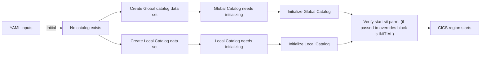
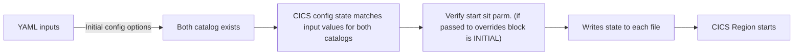
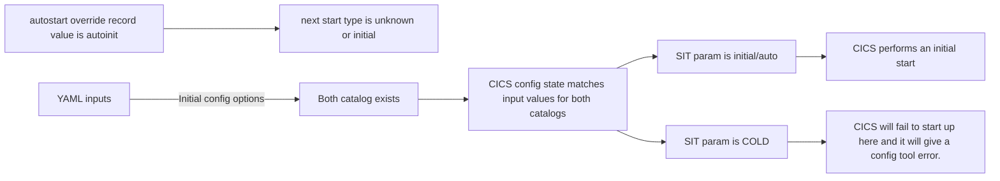
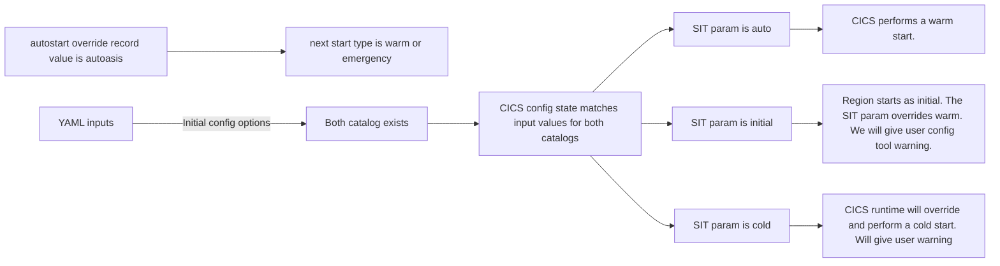
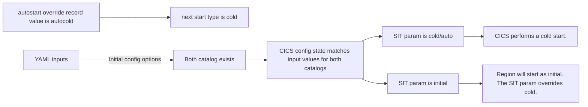
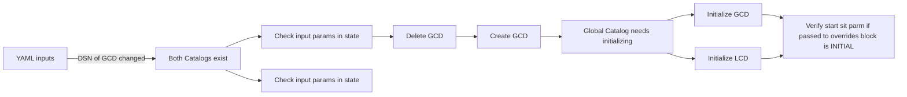
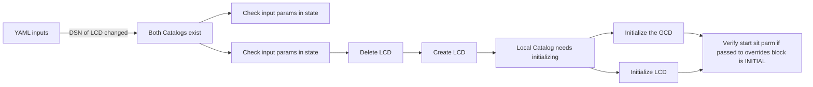

# Global & Local Catalog Behaviour

# Problem Statement
Currently the tool recreates both the Global and Local catalog datasets each time it's run which means all of the essential information CICS requires on a restart following any kind of shutdown is lost.

This document provides a design for the **Global & Local Catalog** datasets in the CICS Config tool.

# Process Flow 
This is the process of how both datasets work during the initial run and every time the tool is re-applied:

### Run n (Initial Run)
1. The tool checks if the dataset files exist. At this point they don't exist so it proceeds to create them.
2. For the Global Catalog the tool runs the `DFHRMUTL` program with `SET_AUTO_START=AUTOINIT` setting the start type as initial. The `next_start_type` will be set by CICS to `unknown` as the region has not yet been started. The state is written to the GCD file.
3. For the Local Catalog it runs the `DFHCCUTL` program initializing the dataset by writing the necessary data from the CICS domains into the local catalog. The data it writes to the Local Catalog file depends on the start type set, in this case since the start type is initial so it initializes the dataset. The state is then written to the LCD file.
4. When the cics region is shutdown the next start type and the autostart change depending on how it was shut. For example, if the shutdown is abnormal e.g (The region job is deleted) the nextstart is set to emergency and the autostart is set to autoasis which is a warm start. 
5. Checks start sit param. If it's the same as what the tool sets then nothing happens. If not it will either override it or an error occurs (This case is covered below in discussion point 1).
6. After a shutdown or failure the state is updated and written to each file.

### Run n + 1
#### Current Behavior
1. The tool checks if both of the datasets exists. At this point they exist and they are both re-created.
2. It then follows the same steps in the initial run. 

#### Desired Behavior
1. The tool checks if both of the datasets exist. At this point they exist so it looks at the input params in the GCD file.
2. It checks that the state matches input values for both catalogs. If it does, then it continues to the next step. If it doesn't, this is covered in discussion point 2 below.
3. Checks start sit param. If it's the same as what the tool sets then nothing happens. If not it will either override it or an error occurs (This case is covered below in discussion point 1).
4. CICS handles how the region starts (updates autostart after shutdown/failure) unless SIT params overrides.
5. It then writes the state to each file.

# Start Types
Below is some is information about what happens for both datasets based on each start type:

#### Initial Start
CICS reinitializes both the global and local catalogs, erasing all information from the previous run. All of the previously installed resource definitions are lost. Nothing from the previous run is saved in the catalogs. This should only be used for a new CICS region or after a serious failure when the catalogs are corrupted. 

#### Cold Start
A cold start is similar to an initial start in that it discards most prior runtime data, but it is typically used in a more controlled manner when the catalogs are still intact. It's used to restart CICS with a fresh state but without the need for a full reinitialization of the physical catalog datasets.

#### Warm or Emergency 
During a warm or emergency start in CICS, both the local and global catalogs are used to restore the region to its previous state. The global catalog restores installed resource definitions and domain status from the end of the previous run, while the local catalog is initialized from the information in the system log. An emergency start is a type of warm start that occurs after an abnormal termination but where the logs are still available for recovery. 

:::note
If either one of the catalogs needs to be redefined and reinitialized, the other one will also need to be reinitialized. After reinitializing both catalog data sets, an initial start must be performed.
:::

# Discussion Points
### 1 - Manually choosing start type (SIT Params)
What if user wants to override the start type. Currently the user can override the set start type in the region yaml file using the START sit parameter. Should we still allow this?

We will keep the SIT parameters exactly how they are now since it maintains consistency as we let users override in other areas. Users will most likely leave the param as auto most of the time but if they want to perform a cold or initial start they will be able to do so unless there is an error e.g.(Attempting to cold start a region during the initial run). When a user sets the param as cold or initial they will also receive a warning to make sure they understand that data will be lost.

Below is what happens for each SIT param alongside each autostart override record and next start type:

###### AUTOINIT region start

###### AUTOASIS region start

###### AUTOCOLD region start

### 2 - Manually Changing the Catalogs
What if the user wants to manually change the catalogs? How do we protect against this?

If a user wants to manually change either of the catalog files e.g.(Changing the DSN) then both of the catalogs will be reinitialized. A new CICS catalog parent task will be added with the original catalog tasks being extended as child tasks. We will hash the contents of both state files to identify changes and reinitialize.

For both the apply and rm runs if the tool detects it needs to delete the global or local catalog, the parent catalog task will check the `next_start_type` in the global catalog. If it's emergency and the -f/--force flag is provided by user the catalog is deleted. If no flag is provided there will be an error and a warning about the catalog being in the emergency state and finally if the next start type is not emergency it will continue as normal and delete when using rm and initialise when using apply.

Below are flow charts showing what happens when either catalog is changed:

Global Catalog:

Local Catalog:

## Related Documents

- [Input Caching Design](./caching_inputs.md) - Parent design document
- [CICSConfig Reconcile Behaviour](https://app.mural.co/t/cics/m/cics/1762869896584/e0abb2ed1002d2f06b41497360a656eee2c60d5c) - Mural for Inputs Cashing Design