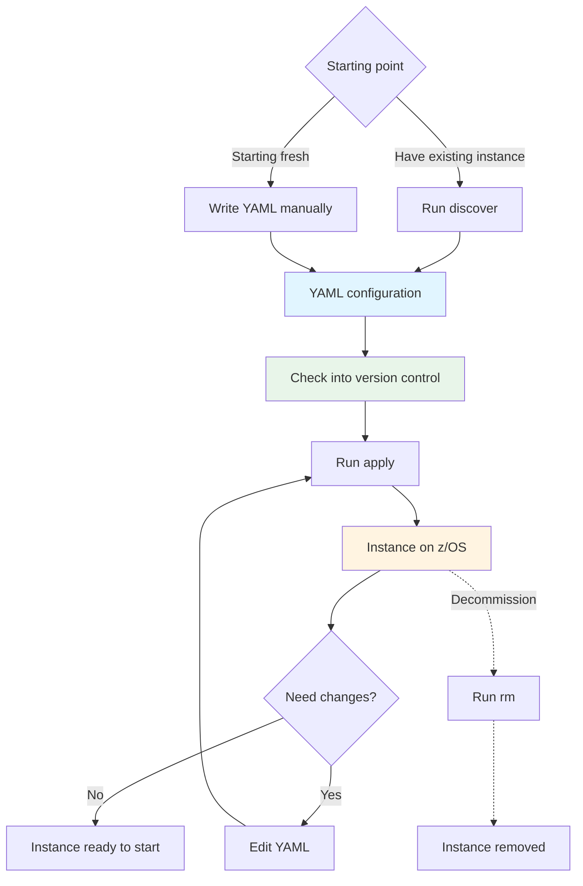

# Basic mechanisms

This document explains the fundamental operations of zconfig for product owners who need to adopt zconfig for their own products. Understanding these mechanisms is essential for implementing zconfig support and helping customers transition to configuration-as-code.

## The three core operations

zconfig provides three primary commands that form a complete configuration lifecycle:

### `discover`

**Purpose:** Extract existing configuration into YAML format.

The `discover` command transforms an existing software instance on z/OS into a YAML configuration file. This extracted configuration becomes the customer's source of truth for configuration-as-code.

**Starting points — at least one of:**
- A running job (the software instance is currently active)
- JCL on disk (the configuration exists but may not be running)

**What it produces:**
- A YAML file containing all configuration for that instance
- Ideally, complete configuration coverage of the instance
- A file that can be checked into source control

**Why this matters:** Customers have existing, working configurations. Rather than forcing them to recreate everything from scratch, `discover` provides a migration path. They can extract their current setup, verify it works, and then begin iterating on it.

**Implementation guidance:** Start with one discovery method (either running job or JCL on disk). Prioritize completeness  —  the discovered YAML should capture all configuration necessary to recreate the instance.

### `apply`

**Purpose:** Create or update a z/OS instance from YAML configuration.

The `apply` command reads a YAML configuration file and creates the corresponding instance on z/OS. This includes all required data sets, z/OS-specific settings, and startup JCL.

**Key characteristics:**

**Idempotent:** Running `apply` multiple times with the same configuration produces the same result. The system converges to the desired state regardless of the current state.

**Declarative:** The YAML describes what the configuration should be, not how to get there. zconfig determines the necessary changes.

**Change-aware:** When configuration changes, `apply` updates the instance to match. The tool may remove everything and recreate it, or ideally, apply only the minimal set of changes needed.

**What it does:**
- Creates all required data sets
- Configures z/OS-specific settings
- Generates startup JCL
- Prepares the instance to be started

**What it does not do:**
- Start the instance (left to customer automation)
- Install the software (assumes installation already exists)

**Why this matters:** Customers can treat their YAML configuration as the authoritative source. They edit the YAML, run `apply`, and the system updates to match. This enables configuration-as-code workflows: version control, peer review, automated testing, and repeatable deployments.

### `rm`

**Purpose:** Remove an instance from z/OS.

The `rm` command deletes an instance, removing all associated data sets and z/OS resources that were created by `apply`.

**What it does:**
- Removes data sets created by the instance
- Cleans up z/OS resources
- Removes the instance from zconfig's tracking

**What it does not do:**
- Stop the instance (left to customer automation)
- Remove the software installation

**Why this matters:** Clean removal is essential for testing, development environments, and decommissioning. Customers need confidence that removing an instance is complete and doesn't leave orphaned resources.

## Where zconfig fits in the workflow

Understanding the boundaries of zconfig's responsibility is critical for implementation:

### Starting point: software is installed

zconfig assumes the software is already installed on z/OS. This typically means:
- Installation via SMP/E or similar mechanisms
- Load modules and resources laid out on disk
- No existing instances required (unless discovering one)

**zconfig does not handle software installation.** That remains the customer's responsibility using their existing processes.

### Ending point: ready to start

zconfig works up to the point where the software could be started. It:
- Creates all necessary configuration
- Generates startup JCL
- Prepares all required resources

**zconfig does not start the instance.** Starting the software is left to the customer's existing automation and submission systems. This respects established operational practices and integrates with existing workflows.

## Configuration lifecycle

The typical workflow for customers using zconfig:

### Initial adoption

**Path 1: Discover existing configuration**
1. Customer has working instance
2. Run `discover` to extract YAML
3. Check YAML into source control
4. Verify by running `apply` in test environment
5. YAML becomes source of truth

**Path 2: Create new configuration**
1. Customer writes YAML configuration
2. Run `apply` to create instance
3. Test and refine
4. Check YAML into source control

### Ongoing use

1. Edit YAML configuration
2. Peer review changes (standard code review)
3. Run `apply` to update instance
4. Repeat as needed

The YAML file is the source of truth. All changes flow through it.

### Decommissioning

1. Run `rm` with instance ID
2. Instance and resources removed
3. YAML remains in source control (historical record)

## Pipeline integration

zconfig commands are designed to integrate into automated pipelines and CI/CD workflows. The command-line interface returns appropriate exit codes and provides structured output suitable for automation.

**Common pipeline patterns:**

**Development workflow:**
1. Developer edits YAML configuration locally
2. Run `apply` to test environment
3. Verify changes
4. Commit YAML to source control
5. Pipeline runs `apply` to staging/production

**Continuous deployment:**
1. YAML changes merged to main branch
2. Pipeline triggered automatically
3. Run `apply` to target environment
4. Automated testing validates deployment
5. Rollback available via previous YAML version

**Environment promotion:**
1. Same YAML configuration used across environments
2. Environment-specific values via variables
3. Pipeline applies configuration to each environment in sequence
4. Consistent configuration across development, test, and production

**Decommissioning automation:**
1. Pipeline detects environment no longer needed
2. Run `rm` to clean up resources
3. Automated verification of cleanup
4. Audit trail maintained in pipeline logs

The idempotent nature of `apply` makes it safe to run repeatedly in pipelines. Failed deployments can be retried without manual intervention. Configuration drift is eliminated because the YAML is the source of truth.

## Implementation requirements for product owners

When adopting zconfig for your product, you must implement:

### For `discover`

- Logic to extract configuration from running jobs or JCL
- Mapping from in-situ configuration to YAML structure
- Validation that discovered configuration is complete
- Testing that discovered YAML can recreate the instance

### For `apply`

- YAML schema defining your configuration structure
- Logic to create all required data sets
- Generation of startup JCL
- Idempotent behavior (repeated applies produce same result)
- Change detection and minimal updates (ideally)
- Validation of configuration before applying

### For `rm`

- Logic to identify all resources created by an instance
- Safe removal of data sets and z/OS resources
- Cleanup of tracking metadata

### General requirements

- Clear documentation of YAML structure
- Examples covering common use cases
- Error messages that guide users to solutions
- Integration with zconfig's task framework
- Support for all three adoption phases (see [Onboarding a product](./onboarding.md))

## Key principles

**Declarative, not imperative:** YAML describes desired state, not steps to achieve it.

**Idempotent by design:** Repeated application produces the same result.

**Respects existing workflows:** Integrates with customer's installation and startup processes.

**Configuration as code:** YAML files are source code, with all the benefits that implies.

**Phased adoption:** Customers can adopt incrementally (see [Onboarding a product](./onboarding.md)).

## Summary

zconfig provides three operations  —  `discover`, `apply`, and `rm`  —  that form a complete configuration lifecycle. It fits between software installation and instance startup, providing a configuration-as-code approach that respects existing customer workflows.

For product owners, implementing zconfig support means providing these three operations for your product, following the architectural patterns zconfig provides, and supporting customers through phased adoption.
