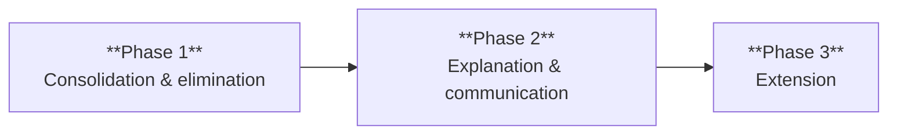

import SideBySideComparison from '@site/src/components/SideBySideComparison';

# Onboarding a product

## Why phased adoption matters

When onboarding your product to zconfig, you're not just building technical integration — you're establishing a migration path that your customers will follow. The approach you take directly impacts their willingness to adopt and their success in doing so.

Customers have decades of configuration investment. They're skeptical of tools that promise simplification but demand wholesale rewrites. They need proof that works incrementally, not promises that require faith.

## The strategic challenge

Your customers face:
- **Complex configuration** built over decades, with undocumented dependencies and tribal knowledge
- **Skills shortage** as experienced staff retire, taking institutional knowledge with them
- **Risk aversion** born from past modernization projects that failed or were abandoned
- **Budget constraints** that prevent multi-year transformation initiatives

Your onboarding strategy must address these realities, not ignore them.

## Phased approach

Onboard your product in three phases. Each phase delivers standalone value to customers, building trust and momentum for the next phase:



### Phase 1: Consolidation and elimination
*Establish trust*

**Goal:** Prove correctness without requiring conceptual changes.

**What you implement:**

- **Consolidation:** Map all product configuration into a single YAML file. Preserve existing terminology and structure — customers should recognize their configuration immediately.

- **Elimination:** Remove format artifacts (JCL punch-card constraints, boilerplate like `DISP=SHR`) while keeping all semantic content. The configuration should be cleaner but conceptually identical.

**Why this phase comes first:** This phase establishes trust. Customers can diff the generated output against their existing configuration and verify correctness. They get immediate benefits (version control, peer review, change control) without learning new concepts or taking on abstraction risk.

**Critical success factor:** The YAML must be a transparent representation of existing configuration. If customers can't map YAML back to their current setup, they won't trust the tool enough to proceed to Phase 2.

**Customer value at this phase:**
- Configuration as code: version control, meaningful diffs, peer review
- Reduced format noise: no more JCL formatting overhead
- Foundation for automation: programmatic configuration manipulation
- Validation: catch errors before deployment

Customers can pause here indefinitely and still benefit. This isn't a compromise — it's a valid stopping point that delivers real value while building confidence for the next phase.

<SideBySideComparison>
  <div>
    <h5>Before (JCL and other proprietary formats)</h5>

```text
// Existing configuration
```

  </div>
  <div>
    <h5>Phase 1 (YAML)</h5>

```yaml
cics_region:
  sysid: RGN1
  applid: CICSRGN1
  region_hlq: REGIONS.CICSRGN1
  local_catalog:
    dsn: REGIONS.CICSRGN1.DFHLCD
  global_catalog:
    dsn: REGIONS.CICSRGN1.DFHGCD
  cics_hlq: INSTALL.CICS63
  cics_data_sets:
    sdfhauth: INSTALL.CICS63.SDFHAUTH
    sdfhload: INSTALL.CICS63.SDFHLOAD
  region_jcl:
    dds:
      - type: concat
        name: SDFHLOAD
        concat_dds:
          - dsn: DBGTOOL.SEQAMOD
  le_hlq: CEE
  sit_parameters:
    gmtext: "Hello from CICS"
    grplist: (DFHLIST,RGN1LIST)
    auxtr: "ON"
    auxtrsw: ALL
    debugtool: YES
```

  </div>
  <div>
The configuration has been moved to YAML, removing a lot of JCL formatting and required settings such as `DISP=SHR`. Familiar names such as the data set titles (e.g. `sdfhauth`) and SIT parameters (e.g. `gmtext`) are present, though they have been lower-cased for readability.

Note that this, and subsequent examples, use indicative configuration. It may be out-of-step with the latest way of configuring specific middleware, but the principles are what matter.
  </div>
</SideBySideComparison>

### Phase 2: Explanation and communication
*Add clarity*

**Goal:** Make configuration self-documenting and reduce cognitive load.

**What you implement:**

- **Explanation:** Provide descriptive `snake_case` alternatives for cryptic abbreviations. Introduce hierarchical structure that makes relationships explicit. For example, `aux_trace.enabled` and `aux_trace.rolling` instead of separate `AUXTR` and `AUXTRSW` parameters.

- **Communication:** Replace low-level option combinations with higher-order options that express intent. When multiple settings always appear together to achieve a specific purpose, provide a single option that captures that purpose. Eliminate redundant specification. If dataset names follow predictable patterns from high-level qualifiers, make the pattern the default and only require overrides for exceptions.

**Why this phase comes second:** Phase 1 proved the tool understands the product correctly. Now customers trust you enough to accept simplification. They're learning new concepts, but they're doing so with a tool they've already validated.

**Implementation guidance:**
- Provide in-editor hints suggesting Phase 2 alternatives for Phase 1 configuration
- Support both forms simultaneously — customers migrate at their own pace
- Document the mapping between Phase 1 and Phase 2 options explicitly
- Ensure Phase 2 options generate identical output to their Phase 1 equivalents

**Customer value at this phase:**
- **Knowledge transfer:** New team members understand configuration without deep product expertise
- **Error reduction:** Intent-based configuration is harder to misconfigure
- **Maintenance velocity:** Changes are faster when configuration explains itself
- **Documentation:** Configuration becomes self-documenting

Customers can pause here and still benefit from significantly improved maintainability. Many will stay at this phase long-term, and that's a successful outcome.

<SideBySideComparison>
  <div>
    <h5>Phase 1</h5>

```diff
  cics_region:
    sysid: RGN1
    applid: CICSRGN1
    region_hlq: REGIONS.CICSRGN1
-   local_catalog:
-     dsn: REGIONS.CICSRGN1.DFHLCD
-   global_catalog:
-     dsn: REGIONS.CICSRGN1.DFHGCD
    cics_hlq: INSTALL.CICS63
-   cics_data_sets:
-     sdfhauth: INSTALL.CICS63.SDFHAUTH
-     sdfhload: INSTALL.CICS63.SDFHLOAD
    region_jcl:
      dds:
        - type: concat
          name: SDFHLOAD
          concat_dds:
            - dsn: DBGTOOL.SEQAMOD
    le_hlq: CEE
    sit_parameters:
      gmtext: "Hello from CICS"
      grplist: (DFHLIST,RGN1LIST)
-     auxtr: "ON"
-     auxtrsw: ALL
      debugtool: YES
```

  </div>
  <div>
    <h5>Phase 2</h5>

```diff
  cics_region:
    sysid: RGN1
    applid: CICSRGN1
    region_hlq: REGIONS.CICSRGN1
    cics_hlq: INSTALL.CICS63
    le_hlq: CEE
    region_jcl:
      dds:
        - type: concat
          name: SDFHLOAD
          concat_dds:
            - dsn: DBGTOOL.SEQAMOD
+   aux_trace:
+     enabled: true
+     rolling: true
    sit_parameters:
      gmtext: "Hello from CICS"
      grplist: (DFHLIST,RGN1LIST)
      debugtool: YES
```

  </div>
  <div>
Individual data sets for the CICS installation and the CICS region are no longer specified, instead relying on conventions of high-level qualifiers (e.g. `region_hlq` and `cics_hlq`).

Multiple configuration options are absorbed into a higher-order option with a hierarchy of sub-options, each of which are written in plain English (e.g. `aux_trace`).
  </div>
</SideBySideComparison>

### Phase 3: Extension
*Add power*

**Goal:** Enable domain-specific abstractions and organizational standards.

**What you implement:**

- **Extension framework:** Provide APIs for creating custom configuration extensions. These extensions can:
  - Define site-wide defaults and standards
  - Integrate vendor tooling with single-line configuration
  - Create product-specific abstractions that match customer mental models
  - Encode organizational best practices as reusable configuration patterns

**Why this phase comes third:** Extensions are powerful but require understanding what you're abstracting. Phases 1 and 2 gave customers that understanding. They've seen how the tool represents their configuration (Phase 1) and how it can be simplified (Phase 2). Now they can build abstractions with confidence.

**Implementation guidance:**
- Document the extension API clearly with examples
- Provide reference implementations for common patterns
- Consider providing official extensions for common vendor integrations
- Ensure extensions compose cleanly with core configuration

**Customer value at this phase:**
- **Organizational standards:** Encode site conventions once, apply everywhere
- **Vendor integration:** Third-party tools provide turnkey configuration
- **Custom abstractions:** Configuration speaks the customer's domain language
- **Reusability:** Common patterns become reusable components

This phase represents full adoption. Customers who reach here have internalized the tool and are extending it for their specific needs.

<SideBySideComparison>
  <div>
    <h5>Phase 2</h5>

```diff
  cics_region:
    sysid: RGN1
    applid: CICSRGN1
    region_hlq: REGIONS.CICSRGN1
    cics_hlq: INSTALL.CICS63
    le_hlq: CEE
-   region_jcl:
-     dds:
-       - type: concat
-         name: SDFHLOAD
-         concat_dds:
-           - dsn: DBGTOOL.SEQAMOD
    aux_trace:
      enabled: true
      rolling: true
    sit_parameters:
      gmtext: "Hello from CICS"
      grplist: (DFHLIST,RGN1LIST)
-     debugtool: YES
```

  </div>
  <div>
    <h5>Phase 3</h5>

```diff
  cics_region:
    sysid: RGN1
    applid: CICSRGN1
    region_hlq: REGIONS.CICSRGN1
    cics_hlq: INSTALL.CICS63
    le_hlq: CEE
    aux_trace:
      enabled: true
      rolling: true
    sit_parameters:
      gmtext: "Hello from CICS"
      grplist: (DFHLIST,RGN1LIST)
+   extensions:
+     debugtool:
+       hlq: DBGTOOL.SEQAMOD
```

  </div>
  <div>
Vendor-provided extensions allow combinations of low-level options to be avoided and the intent specified in domain-specific terminology (e.g. `debugtool` removing extra data sets and SIT parameters).
  </div>
</SideBySideComparison>

## Summary

**All three phases produce identical runtime configuration.** The progression is about human comprehension, maintainability, and organizational leverage — not functional differences.

**This sequence works because:**

1. **Phase 1 establishes trust** through verifiable correctness. Customers prove the tool works before accepting simplification.
2. **Phase 2 adds clarity** once trust exists. Customers learn new concepts with a tool they've already validated.
3. **Phase 3 adds power** once customers understand what they're abstracting. You can't build good abstractions over things you don't trust.

**Each phase is a valid pause point:**
- Pause at Phase 1: Customers get configuration-as-code benefits with minimal conceptual change
- Pause at Phase 2: Customers get self-documenting, maintainable configuration
- Reach Phase 3: Customers have organizational standards as code and custom abstractions

**The key insight:** This isn't about being cautious — it's about being pragmatic. Each phase delivers value. Each phase builds confidence for the next. Customers advance when they're ready, not when you demand it.

**For product teams:** Your onboarding implementation should support all three phases simultaneously. Customers at different phases will coexist. Your tooling must handle Phase 1 configuration, Phase 2 configuration, and Phase 3 extensions in the same deployment. This isn't technical debt — it's the feature that makes adoption possible.

**The alternative, requiring Phase 3 from day one, fails because:**
- You're asking for trust in both the tool *and* the abstractions simultaneously
- Customers can't verify correctness when they don't understand the intermediate representation
- When issues arise, customers have no mental model for debugging
- The adoption barrier is too high, so customers don't start

Build the phases. By supporting all three, letting customers advance at their own pace and offering assistance at every step, we'll achieve adoption.
